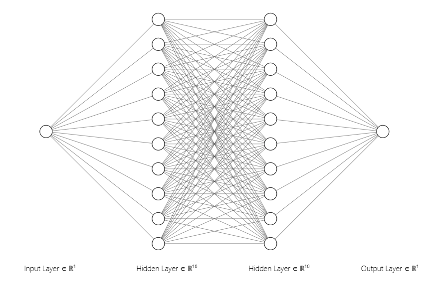
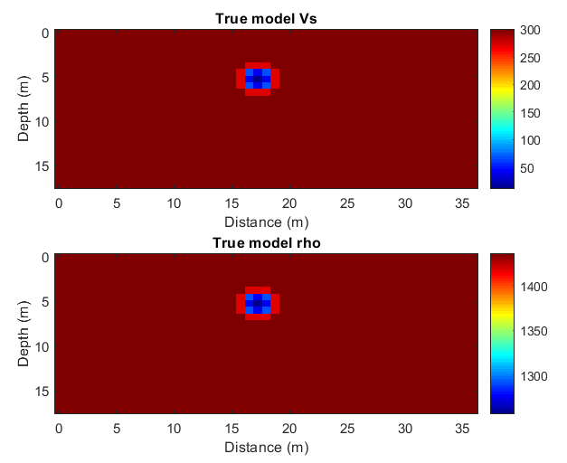
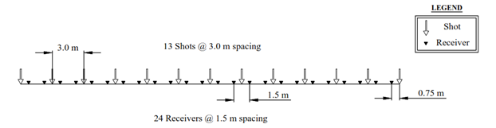
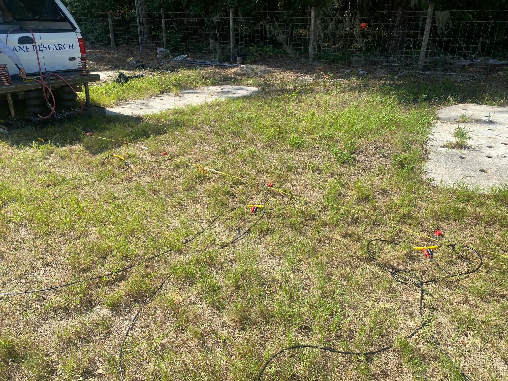
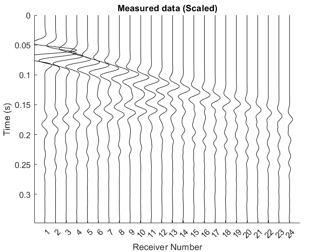
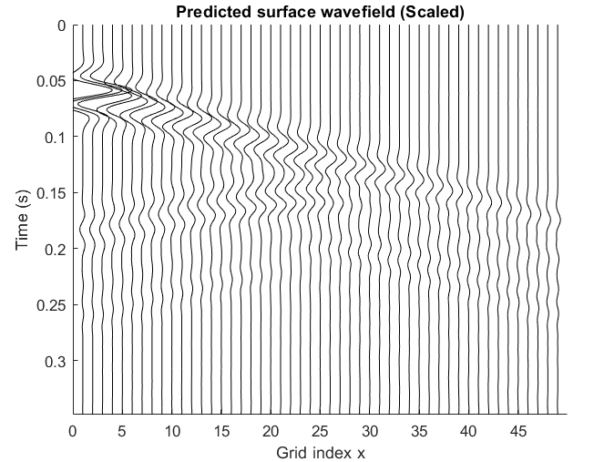
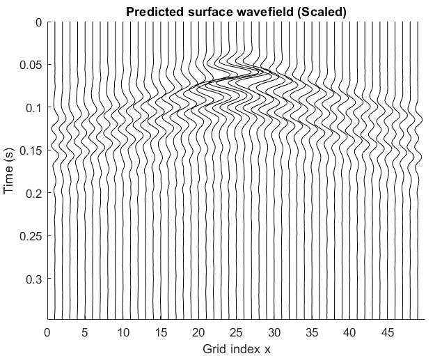
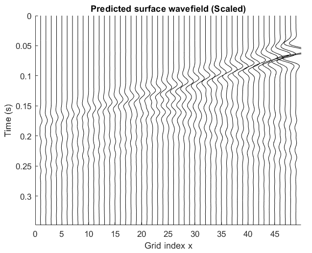

# Final Project – Machine Learning in Geosciences

## 📌 Introduction

In field geophysical surveys, the ability to design and evaluate acquisition configurations—such as source and receiver placement—is essential for collecting useful seismic data. However, practical limitations often arise: not enough geophones, missing source positions, difficult terrain, or time constraints. 

This project explores the use of **artificial neural networks (ANNs)** to learn the relationship between **source–receiver geometry** and the resulting **seismic wavefield**. Using **synthetic data as a proxy for field data**, the trained model can help:

- Predict wavefield recordings at the surface for new or missing source positions.
- Assist in the design and evaluation of field test configurations.
- Provide insight into the sensitivity of wavefields to acquisition geometry.

Once trained, the ANN can approximate wavefield responses for different geometries without testing, offering a flexible tool for supporting survey design and decision-making.

---

## 🧠 Wavefield Prediction Using Neural Networks

This project presents a data-driven approach for predicting seismic wavefields using a feedforward artificial neural network (ANN). Instead of physically collecting seismic data for every possible source–receiver configuration, the ANN is trained to learn the underlying relationship between acquisition geometry and the resulting wavefield. Once trained, the model can predict wavefield responses for new or missing source positions, offering a flexible tool for survey design and planning.

### How It Works

- **Input to ANN**: Normalized source–receiver geometry (e.g., relative distance matrix).
- **Output from ANN**: Normalized seismic wavefield recordings at the surface. 
- **Architecture**: Deep feedforward neural network with ReLU activations:

[ANN Architecture (Example from https://alexlenail.me/NN-SVG/)](https://alexlenail.me/NN-SVG/)

- **Training Data**: Synthetic wavefields generated using finite-difference simulations.
- **Target Use**: Predicting full surface wavefield for unseen or hypothetical source positions. This result can be used to apply Full Waveform Inversion (FWI).

---

## 🔑 Key Features

- Works with 2D seismic wavefield data (e.g., horizontal component).
- Supports arbitrary source–receiver configurations.
- Learns the geometry-to-wavefield mapping from synthetic data.
- Predicts wavefield responses for new source positions.
- Implemented in MATLAB using the Deep Learning Toolbox.

---

## 📊 Example Outputs

To test the feasibility of this approach, we conducted a controlled experiment using a **synthetic model with void** that serves as a simplified representation of **field data**. This setup allows us to evaluate the performance of our method under known conditions before applying it to real-world scenarios.

### **True model to generate wave field**

The true model contains essential subsurface features that influence SH and Love wave propagation. It acts as the ground truth for generating synthetic wavefields.

### **Test configuration**

### **Test configuration in the field**

This figure illustrates the testing configuration, including source and receiver layout, model boundaries, and simulation domain.

### **Synthetic field generation**

A synthetic wavefield  with the first source  is simulated using a finite-difference time-domain (FDTD) solver under the predefined model, and with PML (absorbing boundary condition). This wavefield serves as the target output during neural network training. Note that only one source is shown here. For the training data, we use 13 sources as shown in the test configuration.

### **Measured data recorded at the first source**

This plot shows the synthetic data (as if measured in the field) recorded at the first source location. It is used as ground truth during model training and evaluation. There is a reflected wave propagating backward when the wave reaches the void.

### **Predicted data at the first source**

Prediction results at the first source show strong agreement with the measured data, indicating the model can accurately learn the underlying wavefield structure.

### **Predicted data at the middle source**

At the middle source, the predicted wavefield also closely follows the true wavefield, validating the generalization of the trained model.

### **Predicted data at the last source**

The prediction at the last source confirms the robustness of the network across different source locations within the model.

---

## ✅ Potential Applications

- Planning seismic surveys with incomplete or limited equipment
- Testing different source layouts virtually before field deployment
- Estimating wavefield coverage with fewer measurements
- Educating or demonstrating wave propagation behavior interactively

---

## 🛠️ Requirements

- MATLAB R2021a or later
- Deep Learning Toolbox
- (Optional) Parallel Computing Toolbox for faster training

---

## 📬 Contact

For questions or suggestions, feel free to reach out!
Email: tran.nhat@ufl.edu
---

© 2025 – Final Project for Machine Learning in Geosciences

